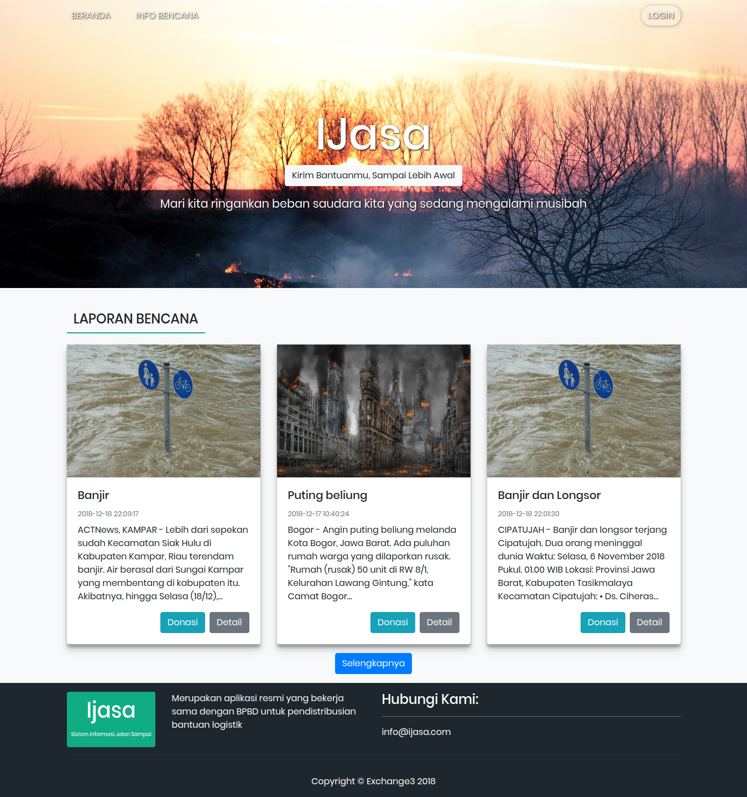

******************
IJasa
******************

Aplikasi jalan sampai, Menampung donasi logistik di sebuah gudang dan menyalurkannya ke bencana yang dipilih oleh donatur

*******************
Feature
*******************
***USER***
1. Melihat info bencana
2. Membuat akun untuk user
3. Melakukan donasi terhadap donasi yang dipilih

***ADMIN***
1. Mengelola informasi bencana

***Petugas***
1. Mencatat kejadian bencana
2. Melakukan validasi terhadap barang yang dikirim oleh donatur

**************************
Pendukung dan bahasa pemrograman
**************************
1. Git
2. HTML
3. CSS
4. JQUERY
5. AJAX
6. Bootstrap
7. Here Map API
8. PHP
9. Codeigniter
10. Mysql

Build own server but localy
1. Ubuntu server
2. Ubuntu router
build on Virtual box
3. Bind9 for make DNS
4. access point and bridge network for bridge to virtual wifi direct access on windows 10
5. Apache2
6. MariaDB
7. Nagios
8. Vsftpd

************
Installation
************

